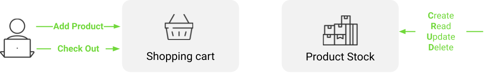
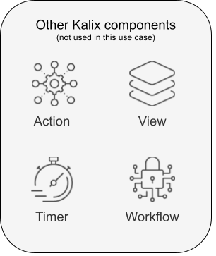
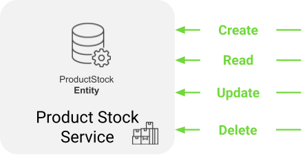
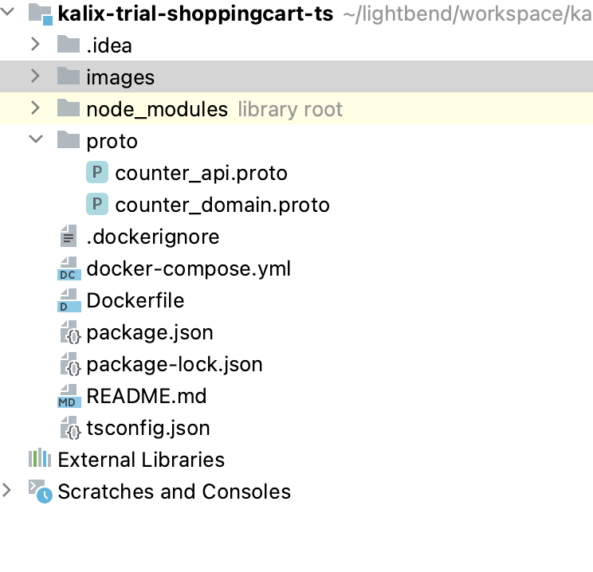

# Prerequisite
Node 18<br>
[cURL](https://curl.se/)<br>
Docker 20.10.14 or higher (to run locally)<br>
# Introduction

If you have gone through the `Explore Kalix Virtaully` journey, you are all set to :
- [Run locally in prod-like environment](#run-locally-in-prod-like-environment) <br>
- [Deploy and run on Kalix Platform on Cloud Provider of your choice ](deploy-and-run-on-kalix-platform-on-cloud-provider-of-your-choice)

However, if you would like to better understand the `Kalix Developer Experience` and how to build applications on Kalix, here is more details on the same-use.
# Kalix Trial - eCommerce - TypeScript
## Designing Kalix Services
### Use case
<br>
eCommerce use case is a simple shopping cart example consisting of product stock and shopping cart.
Product stock models stock (simple quantity) of products that are being sold and Shopping Cart models list of products customer intends to buy.<br>
In this exercise the focus is on implementing Product Stock functionalities
#### Product Stock
Data model:
- quantity

**Note**: Product stock data model does not hold the productId because the HTTP/REST API is designed around productId itself.
Operations:
- CREATE/READ/UPDATE/DELETE product stock

### Kalix components
Kalix components are building blocks used to abstract functionalities.<br>
In this use case we are going to use a Kalix component called `Entity`.<br>
<br>
Entity:
- component for modeling of data and data business logic operations
- removes complexities around data:
    - caching
    - concurrency
    - distributed locking
- simplifies data modeling, business logic implementation with out-of-the box scalability, resilience
  Kalix provides other components that are not used in this use case and more details can be found in [Kalix documentation](https://docs.kalix.io/):<br>
  <br>

### Design Product Stock Kalix service
**Product Stock Service**
- implements Product Stock functionalities
- Kalix component used: Entity



**ProductStock Entity**
- models one product stock instance and business logic operations over that one instance

**Data model**
- quantity

**API**
- HTTP/RES
- Endpoints:
    - **Create**
      `POST /product-stock/{productId}/create`

      Request (JSON):
        - quantity (int)

      Response (JSON): {}
    - **Read**
      `GET /product-stock/{productId}/get`
      Request (JSON): No body

      Response (JSON):
        - quantity (int)
    - **Update**
      `PUT /product-stock/{productId}/update`

      Request (JSON):
        - quantity (int)

      Response (JSON): {}
    - **Delete**
      `DELETE /product-stock/{productId}/delete`

      Request (JSON): No body

      Response (JSON): {}

## Kickstart Kalix development project
Execute in command line:
```
npx @kalix-io/create-kalix-entity@1.1.0 kalix-trial-shoppingcart-ts --typescript
```
And then:
```
 cd kalix-trial-shoppingcart-ts
```
```
 npm install
```
Generated project structure:



- `package.json` with all pre-configured dependencies required development, testing and packaging of Kalix service code
- `node_modules` all modules required for development, testing and packaging of Kalix service code
- `proto` directory with Kalix protobuf examples

**Note**: delete Kalix protobuf example files (`counter_api.proto`, `domain/counter_domain.proto`).<br>

## Define data structure
1. Create directory `productstock` in `proto`
2. Create protobuf file `productstock_domain.proto` in `src/main/protobuf/productstock`
3. Add `ProductStock` protobuf definition that represents `ProductStock` data structure that is persisted:
```
syntax = "proto3";
package com.example.shoppingcart.productstock;
message ProductStock{
    int32 quantity = 1;
}
```

## Define API - Product Stock Entity API
1. Create protobuf file `productstock_api.proto` in `src/main/protobuf/productstock`
2. Add protobuf definitions represending Product Stock API requests:
```
syntax = "proto3";

import "google/protobuf/empty.proto";
import "kalix/annotations.proto";
import "google/api/annotations.proto";

import "productstock/productstock_domain.proto";

package com.example.shoppingcart.productstock;

message CreateProductStockRequest {
  string product_id = 1 [(kalix.field).entity_key = true];
  int32 quantity = 2;
}

message UpdateProductStockRequest {
  string product_id = 1 [(kalix.field).entity_key = true];
  int32 quantity = 2;
}

message DeleteProductStockRequest {
  string product_id = 1 [(kalix.field).entity_key = true];
}

message GetProductStock {
  string product_id = 1 [(kalix.field).entity_key = true];
}
```
3. Add protobuf definition for a `Product Stock` GRPC service with corresponding `rpc` methods representing each endpoint
```
service ProductStockService {
  rpc Create(CreateProductStockRequest) returns (google.protobuf.Empty);
  rpc Get(GetProductStock) returns (ProductStock);
  rpc Update(UpdateProductStockRequest) returns (google.protobuf.Empty);
  rpc Delete(DeleteProductStockRequest) returns (google.protobuf.Empty);
  }
```
4. Exposing HTTP/REST endpoints from GRPC service using [GRPC Transcoding HTTP/JSON to GRPC](https://cloud.google.com/endpoints/docs/grpc/transcoding)
```
service ProductStockService {
  rpc Create(CreateProductStockRequest) returns (google.protobuf.Empty){
    option (google.api.http) = {
      post: "/product-stock/{product_id}/create"
      body: "*"
    };
  }
  rpc Get(GetProductStock) returns (ProductStock){
    option (google.api.http) = {
      get: "/product-stock/{product_id}/get"
    };
  }
  rpc Update(UpdateProductStockRequest) returns (google.protobuf.Empty){
    option (google.api.http) = {
      put: "/product-stock/{product_id}/update"
      body: "*"
    };
  }
  rpc Delete(DeleteProductStockRequest) returns (google.protobuf.Empty){
    option (google.api.http) = {
      delete: "/product-stock/{product_id}/delete"
    };
  }
}
```
### Add default ACL policy
Default ACL policy needs to be added. <br>
1. Create file `kalix_policy.proto` in `proto`
2. Add this content to the file
````
syntax = "proto3";
import "kalix/annotations.proto";
option (kalix.file).acl = {
    allow: {}
};
````
**Note**: more info about [ACL (Access Control List)](https://docs.kalix.io/javascript/access-control.html)
## Implementing business logic
### Code generation
1. Code generation from protobuf definitions
   Kalix node module uses defined protobuf definitions to build required codebase where business logic can be developed in.<br>
   Kalix node module needs to be configured using custom kalix protobuf definition:
```
service ProductStockService {
  option (kalix.codegen) = {
    value_entity: {
      name: "com.example.shoppingcart.productstock.ProductStockEntity"
      entity_type: "product-stock"
      state: "com.example.shoppingcart.productstock.ProductStock"
    }
  };
```
- `value_entity` configures key-value as a durable storage model
- `name` configures the name of the `Entity` class that is being generated
- `entity_type` configures the entity type reference name that can be used to reference `Entity` in other Kalix components
- `state` configures the reference to `ProductStock` protobuf definition defined in `productstock_domain.proto`

2. Generate code using Kalix node module:
```
npm run build
```
Generated code:
- `lib/generated` folder containing Kalix generated help resources
- `src/index.ts` file controlled by Kalix module that bootstraps
- `src/productstockentity.ts` skeleton file where business logic needs to be developed in
- `test/productstockentity.test.ts` skeleton mocha test file where unit tests need to be developed in

### ProductStockEntity business logic
Generated file `src/productstockentity.ts` provides skeleton methods that need to be implemented for each endpoint.<br>
We need to add `GrpcStatus` import to be able to use it in our business logic for returning `NOT_FOUND` error status:
```
import {GrpcStatus} from "@kalix-io/kalix-javascript-sdk";
```
#### `create` endpoint
Business logic for create is to persist product stock data if not yet exists. In other cases returns an ERROR.
```
Create(command, state, ctx) {
if(state == ProductStock.create({})) {
  ctx.updateState(ProductStock.create({quantiy: command.quantity}));
  return Reply.message({});
}
return Reply.failure("Already created");
}
```
### `get` endpoint
Business logic for get is to get product stock data if it exists and if not return not found error.
```
Get(command, state, ctx) {
if(state == ProductStock.create({}))
  return Reply.failure("Not found", GrpcStatus.NotFound);
return Reply.message(state);
}
```
### `update` endpoint
Business logic for update is to update product stock data if product was already created. If product is not found, return NOT FOUND error.
```
Update(command, state, ctx) {
if(state == ProductStock.create({})) {
  return Reply.failure("Not found", GrpcStatus.NotFound);
}
state.quantity = command.quantity;
ctx.updateState(state);
return Reply.message({});
}
```
### `delete` endpoint
Business logic for delete is delete data if product stock exists and return NOT FOUND error if not.
Here the soft delete is done by updating the state to `ProductStock.create({})`.
```
Delete(command, state, ctx) {
if(state == ProductStock.create({})) {
  return Reply.failure("Not found", GrpcStatus.NotFound);
}
state = ProductStock.create({});
ctx.updateState(state);
return Reply.message({});
}
```
## Test
Kalix comes with very rich test kit for unit and integration testing of Kalix code.

`Test kit` provides help (custom assertions, mocks,...) with:
- unit testing of individual Kalix components (e.g `Entity`) in isolation
- integration testing in Kalix Platform simulated environment in isolation

- Allows easy test automation with very high test coverage

### Unit test
Kalix SDK uses [MochaJS](https://mochajs.org/) and for building unit tests and [ChaiJS](https://www.chaijs.com/) for assertion.
1. Edit `test/productstockentity.test.ts`
2. Delete all tests instead of `handle command Create`
3. Add following test code:
```
describe("Create", () => {
    it("should...", async () => {
      const entity = new MockValueEntity(productstockentity, entityId);
      const productId = "prod1";
      let quantity = 10;
      const createResult = await entity.handleCommand("Create",
          {
              productId: productId,
              quantity: quantity
          }
      );
      expect(entity.error).to.be.undefined;
      expect(createResult).to.deep.equals({});
      // @ts-ignore
      expect(entity.state.quantity).to.deep.equal(quantity);
    });
});
```
`MockValueEntity` is used to mock the behaviour of an `Entity`.<br>

4. Run the unit test:
```
npm run test
```
### Integration test
Kalix test kit for integration testing runs code using test containers to simulate Kalix Platform runtime environment.
Integration test uses generated grpc client.
1. Create file `test/productstock.integration-test.ts`
2. Add following test code:
```
import { IntegrationTestkit } from "@kalix-io/testkit";

const testkit = new IntegrationTestkit();

import {expect} from "chai"

import productstockentity from "../src/productstockentity";

testkit.addComponent(productstockentity);

function client() {
    return testkit.clients.ProductStockService;
}

describe("ProductStockService",  function () {
    this.timeout(60000);

    before(done => testkit.start(done));
    after(done => testkit.shutdown(done));

    it("Create", async () => {
        const productId = "prod1";
        let quantity = 1;
        await client().createAsync({productId: productId, quantity: quantity});

        const get = await client().getAsync({productId: productId});
        expect(get.quantity).to.deep.equal(quantity);
    });
})
```
Run the integration test:
```
npm run test
```
### Run locally in prod-like environment
1. Run the Kalix Proxy container:
```
docker-compose up
```
2. Run Kalix service locally:
```
npm run start
```
This command runs the Kalix service locally and exposes it on `localhost:9000`.
#### Test
Testing using `CURL`:
1. Create product:
```
curl -XPOST -d '{ 
  "quantity": 10
}' http://localhost:9000/product-stock/apple/create -H "Content-Type: application/json"
```
Result:
```
"{}"
```
2. Get product:
```
curl -XGET http://localhost:9000/product-stock/apple/get
```
Result:
```
{"quantity":10}
```
3. Update product:
```
curl -XPUT -d '{
"quantity": 20
}' http://localhost:9000/product-stock/apple/update -H "Content-Type: application/json"
```
Result:
```
"{}"
```
4. Delete product:
```
curl -XDELETE http://localhost:9000/product-stock/apple/delete
```
Result:
```
"{}"
```
### Deploy and run on Kalix Platform on Cloud Provider of your choice
1. Install Kalix CLI
   https://docs.kalix.io/setting-up/index.html#_1_install_the_kalix_cli
2. Kalix CLI
1. Register (FREE)
   ```
   kalix auth signup
   ```
   **Note**: Following command will open a browser where registration information can be filled in<br>
2. Login
   ```
   kalix auth login
   ```
   **Note**: Following command will open a browser where authentication approval needs to be provided<br>

3. Create a project
   ```
   kalix projects new ecommerce --region=gcp-us-east1
   ```
   **Note**: `gcp-is-east1` is currently the only available region for deploying trial projects. For non-trial projects you can select Cloud Provider and regions of your choice<br>

4. Authenticate local docker for pushing docker image to `Kalix Container Registry (KCR)`
   ```
   kalix auth container-registry configure
   ```
   **Note**: The command will output `Kalix Container Registry (KCR)` path that will be used to configure `dockerImage` in `pom.xml`<br>
5. Extract Kalix user `username`
   ```
   kalix auth current-login
   ```
**Note**: The command will output Kalix user details and column `USERNAME` will be used to configure `dockerImage` in `pom.xml`<br>
3. Configure `dockerImage` path in `package.json`
   Replace `my-docker-repo` in `dockerImage` in `package.json` with: <br>
   `Kalix Container Registry (KCR)` path + `/` + `USERNAME` + `/ecommerce`<br>
   **Example** where `Kalix Container Registry (KCR)` path is `kcr.us-east-1.kalix.io` and `USERNAME` is `myuser`:<br>
```
"dockerImage": "kcr.us-east-1.kalix.io/myuser/ecommerce/kalix-trial-shoppingcart-ts"
```
4. Deploy service in Kalix project:
 ```
npm run deploy
 ```
This command will:
- execute tests
- package into a docker image
- push the docker image to Kalix docker registry
- trigger service deployment by invoking Kalix CLI
5. Check deployment:
```
kalix service list
```
Result:
```
kalix service list                                                                         
NAME                                         AGE    REPLICAS   STATUS        IMAGE TAG                     
kalix-trial-shoppingcart-ts                  50s    0          Ready         0.0.1                
```
**Note**: When deploying service for the first time it can take up to 1 minute for internal provisioning
#### Proxy connection to Kalix service via Kalix CLI
1. Proxy connection to Kalix service via Kalix CLI
```
kalix service proxy kalix-trial-shoppingcart-ts
```
Proxy Kalix CLI command will expose service proxy connection on `localhost:8080`.
#### Test
Testing using `CURL`:
1. Create product:
```
curl -XPOST -d '{ 
  "quantity": 10
}' http://localhost:8080/product-stock/apple/create -H "Content-Type: application/json"
```
Result:
```
"{}"
```
2. Get product:
```
curl -XGET http://localhost:8080/product-stock/apple/get
```
Result:
```
{"quantity":10}
```
3. Update product:
```
curl -XPUT -d '{
"quantity": 20
}' http://localhost:8080/product-stock/apple/update -H "Content-Type: application/json"
```
Result:
```
"{}"
```
4. Delete product:
```
curl -XDELETE http://localhost:8080/product-stock/apple/delete
```
Result:
```
"{}"
```